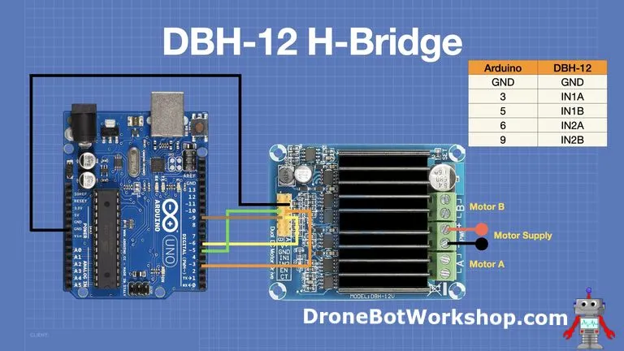

#  DBH12-Bridge

Integration of Hbridge DBH12 

some example https://dronebotworkshop.com/dc-motor-drivers/

The library use the pwm ldec of esp32 I have to test other pwm in order to get the library functioning with other esp 

## The goal

Manage a DC motor smoothly in two directions
Manage a DC motor brake
Manage the current of the motor controller

## TODO

- [ ] Remove printf to make trace by define macro
- [ ] Add a PID asservisement to drive motor with the current feelback
- [ ] Add unit test